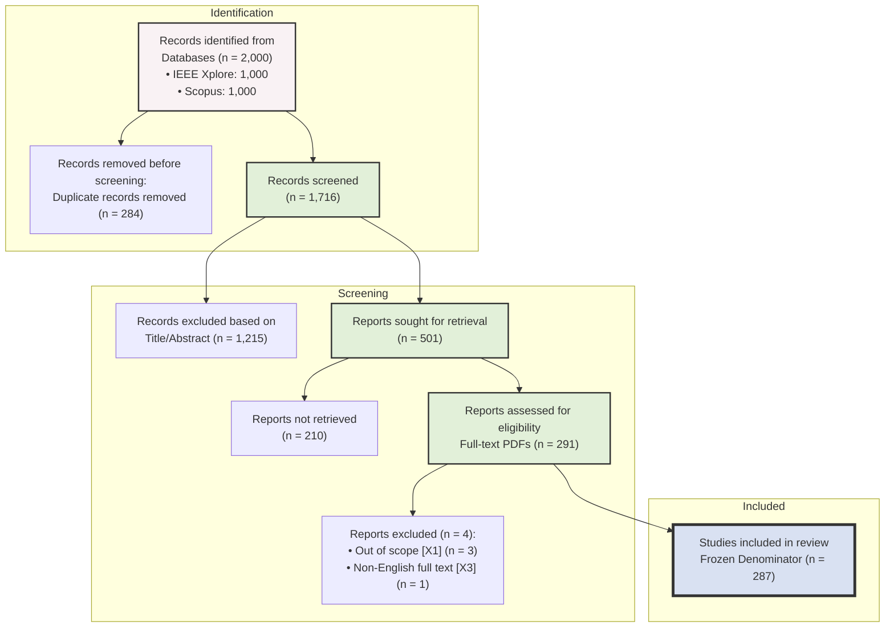

# PRISMA 2020 Flowchart

This document provides a visual representation of the systematic literature review (SLR) pipeline census for the GPS-Denied UAV project.

## Census Breakdown
* **Raw:** 2,000
* **Unique:** 1,716
* **Screened-in (Title/Abstract):** 501
* **Full-text Retrieved:** 291
* **Final Included:** 287
